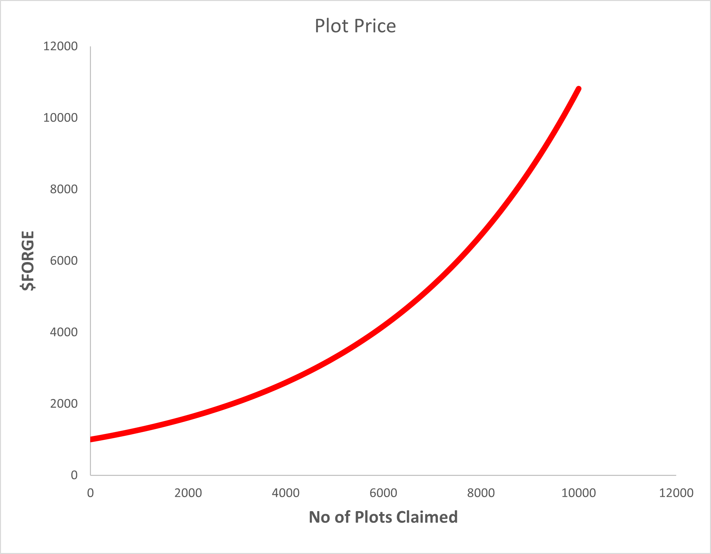

# Purchasing Plots

80x80 blocks of land will be available for purchase within the BlockForge Minecraft Server. These plots of land can be purchased with the use of $FORGE Tokens. Plots of land are stored as an ERC-721 token on the blockchain. There will be 10,000 plots of land for purchase within the BlockForge world. The price of plots are dynamic and vary based on the number of plots that have already been sold. The price of the plot is calculated dynamically using the formula shown below:

# Plot Ranking
Plots are ranked based on the amount of “Diamond” it houses.  The higher the amount of “Diamond” ore present within a plot, the higher the rank. The rank of a plot is directly related to the amount of Diamond present within it.
Plot rankings can affect the amount of tokens the plot can generate. A plot with a higher rank will generate more $FORGE tokens per day. Players can increase the rank of their land by staking and opening it for vulnerability.
